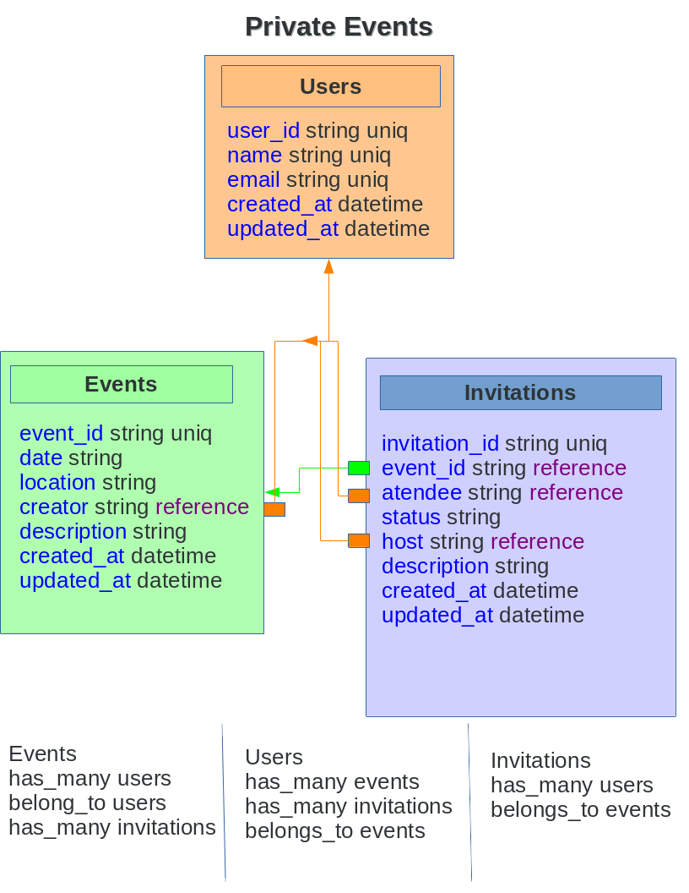

[![Contributors][contributors-shield]][contributors-url]
[![Forks][forks-shield]][forks-url]
[![Stargazers][stars-shield]][stars-url]
[![Issues][issues-shield]][issues-url]
[![MIT License][license-shield]][license-url]

 

  

  <h3 align="center">
	 Private Events
  </h3>

  

    Allows users to create events and then manage user signups. Users can create events and send invitations and parties. Events take place at a specific date and at a location.
     
    <a href="https://github.com/Israel-Laguan/Private-Events/blob/master/README.md"><strong>Explore the docs 📚</strong></a>
     
     
	  🖊️
    <a href="https://www.theodinproject.com/courses/ruby-on-rails/lessons/associations#your-task">Assigment</a>
    🐛
    <a href="https://github.com/Israel-Laguan/Private-Events/issues">Report Bug</a>
    🙏
    <a href="https://github.com/Israel-Laguan/Private-Events/issues">Request Feature</a>
  

# Advanced Forms and Active Record
## Project: Associations
Users can create events and send invitations and parties. Events take place at a specific date and at a location. An application named Private Events that behaves similar to [Eventbrite](https://www.eventbrite.com/). The main goal is to put in practice the main concepts of Associations in rails.

# Validations

Rubocop: 

# Features

* Using different databases for development (sqlite3) and production (postgres)
* Followed the [tutorial](https://www.learnenough.com/ruby-on-rails-4th-edition-tutorial/user_microposts) 
* Associates several tables on the database using foreign keys:

* Use of `sessions`, `cookies` and `flash`
* Modifies `routes.rb`
* Managed state with data on DB
* Tests made with [`RSpec`](https://relishapp.com/rspec/)

# Built With

* `ruby` v2.5.5
* `rails` v5.2.3+
* RVM
* `vscode` with _Ruby_ and _Rubocop_ extensions
* Linux
* Love and Passion for code.

# Authors

* [Aheebwa Ramadhan](https://github.com/raheebwa)
<table style="width:100%">
  <tr>
    <td>
        

            
            <h2>
                <a href="https://israel-laguan.github.io/" target="_blank" rel="author">
                    Israel Laguan
                </a>
            </h2>
        

    </td>
    <td>
        

            <a href="mailto:israellaguan@gmail.com" target="_blank" rel="author">
                
                <h3>
                    Email me to 
                    <a href="mailto:israellaguan@gmail.com">
                        israellaguan@gmail.com
                    </a>
                </h3>
            </a>
            <a href="https://www.linkedin.com/in/israellaguan/" target="_blank" rel="author">
                
                <h3>
                    Connect to my Linkedin
                </h3>
            </a>
            <a href="https://github.com/Israel-Laguan" target="_blank" rel="author">
                
                <h3>
                    Check my GitHub Profile
                </h3>
            </a>
        

    </td>
  </tr>
</table>

# License

This project is licensed under the MIT License - see the [LICENSE.md](LICENSE.md) file for details 

<!-- ACKNOWLEDGEMENTS -->
## Acknowledgements
* [Microverse](https://www.microverse.org/)
* [The Odin Project](https://www.theodinproject.com/)
* [Readme header author](https://github.com/collinsugwu/Microverse201-Enumerable-Methods)

<!-- MARKDOWN LINKS & IMAGES -->
<!-- https://www.markdownguide.org/basic-syntax/#reference-style-links -->
[contributors-shield]: https://img.shields.io/github/contributors/Israel-Laguan/Private-Events.svg?style=flat-square
[contributors-url]: https://github.com/Israel-Laguan/Private-Events/graphs/contributors
[forks-shield]: https://img.shields.io/github/forks/Israel-Laguan/Private-Events
[forks-url]: https://github.com/Israel-Laguan/Private-Events/network/members
[stars-shield]: https://img.shields.io/github/stars/Israel-Laguan/Private-Events
[stars-url]: https://github.com/Israel-Laguan/Private-Events/stargazers
[issues-shield]: https://img.shields.io/github/issues/Israel-Laguan/Private-Events
[issues-url]: https://github.com/Israel-Laguan/Private-Events/issues
[license-shield]: https://img.shields.io/github/license/Israel-Laguan/Private-Events
[license-url]: https://github.com/Israel-Laguan/Private-Events/blob/master/LICENSE.txt
